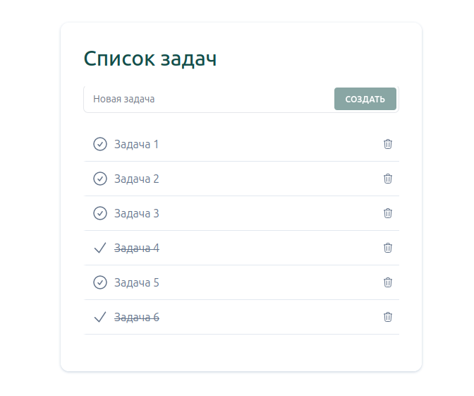

It's a simple example ToDo application with Node.js, Vue.js (styled by tailwind) and Neo4j.  
To launch the application just run `docker compose up -d` and go to http://localhost:8080/
Neo4j browser available at http://localhost:7474/browser/ (database url "neo4j://localhost:7687", user "neo4j", password "12345678" as in .env file)

